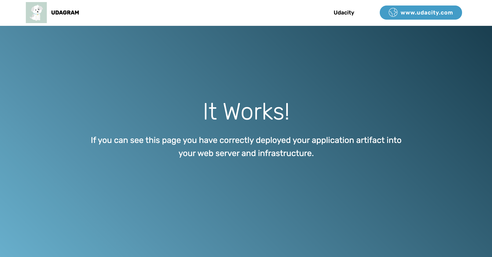

### Project - Deploy a high-availability web app using CloudFormation

This folder contains the project files for second project of the Udacity DevOps Nanodegree Program
The project link is http://udaci-serve-1ivm55i4trkie-657382184.us-west-2.elb.amazonaws.com/

#### infrastructure.yml

This file contains the code for building the cloud infrastructure using AWS CloudFormation, as required for the project.

#### parameters.json

This JSON file holds parameters for the cloud formation script
